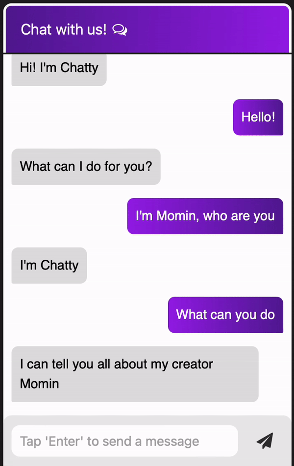

<br />
  <h2 align="center">Chatty!</h2>
  <p align="center">
    Machine learning chatbot application with user-friendly design
    <br />
    <br />
    <a href="https://github.com/Momin-C/Chatty/issues">Report Bug</a>
  </p>
</p>

[![LinkedIn][linkedin-shield]][linkedin-url]

## Table of Contents

* [About the Project](#about-the-project)
    * [Developed Using](#developed-using)
* [Demo](#demo)
* [Getting Started](#getting-started)
    * [Prerequisites](#prerequisites)
* [Contributing](#contributing)
* [References](#references)
* [Contact](#contact)

## About The Project

Chatty is a machine learning chatbot which uses Natural Language Processing to read what a user says and send a pre-written response.

### Developed Using
This project was developed in Python, Javascript and HTML/CSS using the following Python modules:
* [PyTorch](https://pytorch.org)
* [Flask](https://flask.palletsprojects.com/en/2.1.x/)
* [NumPy](https://numpy.org)
* [NLTK](https://www.nltk.org)

## Demo

A demo GIF can be seen below, but the best demo is to try it out on your own!



## Getting Started

### Prerequisites
To use this app, some packages need to be installed, download these packages from your terminal
```sh
pip3 install numpy
pip3 install Flask
pip3 install nltk
pip3 install torch
```

Then clone the repository

```sh
git clone https://github.com/Momin-C/Chatty.git
```

Insert sample intents following the original format in the intents JSON file, run the ```train.py``` program and then run ```app.py```, once you've done that open the link given in the shell.

## References

* Thanks to [NeuralNine](https://www.youtube.com/watch?v=1lwddP0KUEg) and [Python Engineer](https://www.youtube.com/watch?v=a37BL0stIuM) for instructions on how to create the model and connect the app using Flask
* Thank you [DesignCourse](https://www.youtube.com/watch?v=D-h8L5hgW-w) and [Code Palace](https://www.youtube.com/watch?v=He0xK1x-vnI) for the HTML/CSS and Javascript tutorials
* Credit to othneildrew for the [README template](https://github.com/othneildrew/Best-README-Template/blob/master/BLANK_README.md)

## Contact

Momin Chaudhry - [@momin_c](https://instagram.com/momin_c) - hellomomins@yahoo.com

[linkedin-shield]: https://img.shields.io/badge/-LinkedIn-black.svg?style=flat-square&logo=linkedin&colorB=555
[linkedin-url]: https://www.linkedin.com/in/momin-chaudhry/